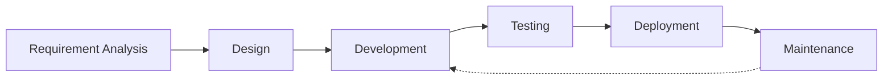

# Table of Contents

- 🔍 [Current Projects](#-current-projects)
  - 📱 [MMVM - Moje město v mobilu](#-mmvm---moje-město-v-mobilu)
  - 📱 [Zvono Pawnshop](#-zvono-pawnshop)
- 📚 [Work Experience & Projects](#-work-experience--projects)
  - 👨‍💻 [Freelancer (2019 - Present)](#-freelancer-2019---present)
  - 👨‍💻 [As4u.cz (2014 - 2018)](#-as4ucz-2004---2018)

## 🔍 Current Projects

### MMVM - Moje město v mobilu

Mobile applications for Czech towns. Repo: [as4u/mmvm](https://github.com/miccy-dev/as4u/mmvm)

- 📱 MMVM - New version in development
- 🏛️ Multiple city variants

### Zvono Pawnshop

Complete business solution. Repo: [zvono](https://github.com/miccy-dev/zvono)

- 👨‍💼 Internal customer management system
- 🌐 Company presentation website
- 🚧 In active development

## Freelancer (2019 - Present)

| Název                                                      | Klient                                             | Doba trvání       | Stack                             |
| ---------------------------------------------------------- | -------------------------------------------------- | ----------------- | --------------------------------- |
| [SPUD Now](https://spudnow.co.uk/)                         | DownloDev                                          | 03/2023 - 08/2024 | Expo, TypeScript, React Native    |
| [Union](https://www.union.sk/union-zp-aplikacia-na-mobile) | [BOOTIQ](https://www.bootiq.io)                    | 03/2022 - 10/2022 | TypeScript, GraphQL, React Native |
| [Mamio](https://www.mamio-app.com)                         | [Eliaš IT Solutions](https://elias-itsolutions.sk) | 05/2021 - 12/2022 | React Native, Expo                |
| [Tlappka](https://www.tlappka.cz/)                         | [Veevoy](https://veevoy.com)                       | 2023              | React Native, Expo                |
| [myPlann](https://www.sabservis.cz/myplann)                | [SABService](https://www.sabservis.cz)             | 2022              | React Native, Expo                |
| Keys of the Treasure                                       | [Sundisk](https://www.sundisk.cz/cs/)              | 2020              | React Native, Expo, Firebase      |

## As4u.cz (2014 - 2018)

- Employer: [As4u.cz](https://www.as4u.cz/)
- Repo: [as4u](https://github.com/miccy-dev/as4u)

| Název                       | Rok       | Stack                                          |
| --------------------------- | --------- | ---------------------------------------------- |
| Turnov v mobilu             | 2024      | Expo, React Native, Supabase, Drizzle ORM      |
| Praha 11                    | 2024      | Expo, React Native, Supabase, Drizzle ORM      |
| Cestovatelský fotodeník     | 2023      | Expo, React Native                             |
| Vrbno v mobilu              | 2023      | React Native (Android / iOS)                   |
| Prostějov v mobilu          | 2023      | Expo, React Native                             |
| Jablonec v mobilu           | 2014-2024 | Migrace z Ionic/Cordova na React Native a Expo |
| Litovel v mobilu            | 2016-2024 | React Native (Android / iOS)                   |
| Šumperk v mobilu            | 2023      | React Native a Expo                            |
| Jindřichův Hradec v mobilu  | 2015-2023 | Migrace z Cordova na React Native a Expo       |
| Kuřim v mobilu              | 2014-2023 | React Native a Expo                            |
| Poznej Hradec               | 2014-2023 | React Native (Android / iOS)                   |
| BITVA 1866                  | 2016-2023 | Android/iOS                                    |
| Dny Evropského Dědictví     | 2022      | Expo, React Native                             |
| Textilní a oděvní dílna     | 2016      | Native Android (Java)                          |
| Kojetín v mobilu            | 2020      | Expo, React Native                             |
| Týniště nad Orlicí          | 2020      | Expo, React Native                             |
| Český ráj                   | 2020      | Expo, React Native                             |
| Český systém kvality služeb | 2015      | Cordova (Android/iOS)                          |
| Mladoboleslavsko            | 2015      | Ionic/Cordova (Android/iOS)                    |
| Průvodce Libereckým krajem  | 2015      | Ionic/Cordova (Android/iOS)                    |

## 📊 GitHub Stats

## 🔥 Featured Projects

  

## 🔄 My Development Workflow

