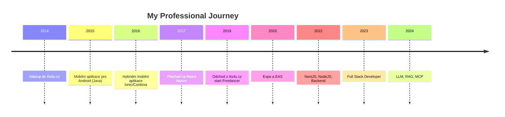

  
  

    <h1 style="margin: 0; font-size: 2.5em; color: white !important; text-shadow: 2px 2px 4px rgba(0, 0, 0, 0.5);">Miloš Macek</h1>
    
Full Stack Developer

    
Mobile | Web | Desktop | BaaS | SaaS | LLM | MCP | Bitcoin

  

 

  
  
  
  

 

  <a href="#-o-mně">O mně</a>
  ·
  <a href="#-tech-stack">Tech Stack</a>
  ·
  <a href="#-vzdělání">Vzdělání</a>
  ·
  <a href="#-pracovní-zkušenosti-a-projekty">Projekty</a>
  ·
  <a href="#-aktuální-projekty">Aktuální projekty</a>
  ·
  <a href="#-kontakty">Kontakt</a>

<!-- 

Skrytý obsah pro nástroje

## 📋 Obsah

- [📋 Obsah](#-obsah)
- [🚀 O mně](#-o-mně)
- [🛠 Tech Stack](#-tech-stack)
- [🔄 Timeline](#-timeline)
- [👨‍🎓 Vzdělání](#-vzdělání)
  - [🎓 2010 - 2014](#-2010---2014)
  - [🎓 2008 - 2010](#-2008---2010)
  - [🎓 2004 - 2008](#-2004---2008)
- [📚 Pracovní zkušenosti a projekty](#-pracovní-zkušenosti-a-projekty)
  - [💼 Freelancer (2019 - současnost)](#-freelancer-2019---současnost)
  - [💼 As4u.cz (2014 - 2018)](#-as4ucz-2004---2018)
- [🔭 Aktuální projekty](#-aktuální-projekty)
  - [🎨 miccy-verse](#-miccy-verse)
  - [₿ SATstation](#-satstation)
  - [💎 Zvono Pawnshop](#-zvono-pawnshop)
  - [💡 Ignis WLED controller](#-ignis-wled-controller)
- [📫 Kontakty](#-kontakty)

  -->

## 🚀 O mně

Jsem nezávislý full-stack vývojář s patnáctiletou zkušeností. Dříve jsem se specializoval hlavně na vývoj mobilních aplikací, ale v současné době se zaměřuji více na backend, SaaS, neopomíjím ani novinky ohledně webových aplikací, zkoumám možnosti integrace LLMs. Mým cílem je vytvářet robustní, uživatelsky přívětivá řešení, která propojují osvědčené postupy a nově vznikající technologie.

## 🛠 Tech Stack

<table width="100%" border="0" cellspacing="0" cellpadding="0" style="border-collapse: collapse;">
  <tr>
    <td width="200" style="border: none; padding: 0;"><strong>Programovací jazyky:</strong></td>
    <td align="right" style="border: none; white-space: nowrap; padding: 10px 0 0 0;">
    
    </td>
  </tr>
  <tr>
    <td width="200" style="border: none; padding: 8px 0;"><strong>Mobile:</strong></td>
    <td align="right" style="border: none; white-space: nowrap;">
      
    </td>
  </tr>
  <tr>
    <td width="200" style="border: none; padding: 8px 0;"><strong>Frontend:</strong></td>
    <td align="right" style="border: none; white-space: nowrap;">
      
    </td>
  </tr>
  <tr>
    <td width="200" style="border: none; padding: 8px 0;"><strong>Backend:</strong></td>
    <td align="right" style="border: none; white-space: nowrap;">
      
    </td>
  </tr>
  <tr>
    <td width="200" style="border: none; padding: 8px 0;"><strong>Desktop:</strong></td>
    <td align="right" style="border: none; white-space: nowrap;">
      
    </td>
  </tr>
  <tr>
    <td width="200" style="border: none; padding: 8px 0;"><strong>State:</strong></td>
    <td align="right" style="border: none; white-space: nowrap;">
      
    </td>
  </tr>
  <tr>
    <td width="200" style="border: none; padding: 8px 0;"><strong>API:</strong></td>
    <td align="right" style="border: none; white-space: nowrap;">
      
    </td>
  </tr>
  <tr>
    <td width="200" style="border: none; padding: 8px 0;"><strong>Backend as a Service:</strong></td>
    <td align="right" style="border: none; white-space: nowrap;">
      
    </td>
  </tr>
  <tr>
    <td width="200" style="border: none; padding: 8px 0;"><strong>Database & ORM:</strong></td>
    <td align="right" style="border: none; white-space: nowrap;">
      
    </td>
  </tr>
  <tr>
    <td width="200" style="border: none; padding: 8px 0;"><strong>DevOps & CI/CD:</strong></td>
    <td align="right" style="border: none; white-space: nowrap;">
      
    </td>
  </tr>
  <tr>
    <td width="200" style="border: none; padding: 8px 0;"><strong>Testování:</strong></td>
    <td align="right" style="border: none; white-space: nowrap;">
      
    </td>
  </tr>
  <tr>
    <td width="200" style="border: none; padding: 8px 0;"><strong>Monitoring:</strong></td>
    <td align="right" style="border: none; white-space: nowrap;">
      
    </td>
  </tr>
  <tr>
    <td width="200" style="border: none; padding: 8px 0;"><strong>Vývojové nástroje:</strong></td>
    <td align="right" style="border: none; white-space: nowrap;">
      
    </td>
  </tr>
  <tr>
    <td width="200" style="border: none; padding: 8px 0;"><strong>Autentizace:</strong></td>
    <td align="right" style="border: none; white-space: nowrap;">
      
    </td>
  </tr>
  <tr>
    <td width="200" style="border: none; padding: 8px 0;"><strong>Platební brány:</strong></td>
    <td align="right" style="border: none; white-space: nowrap;">
      
    </td>
  </tr>
  <tr>
    <td width="200" style="border: none; padding: 8px 0;"><strong>CMS:</strong></td>
    <td align="right" style="border: none; white-space: nowrap;">
      
    </td>
  </tr>
  <tr>
    <td width="200" style="border: none; padding: 8px 0;"><strong>AI & ML:</strong></td>
    <td align="right" style="border: none; white-space: nowrap;">
      
    </td>
  </tr>
</table>

## 🔄 Timeline

## 👨‍🎓 Vzdělání

### 🎓 2010 - 2014

**Technická univerzita v Liberci, Fakulta elektrotechniky a informatiky**

- Obor Informační technologie
- Nedokončeno

### 🎓 2008 - 2010

**ČVUT, Fakulta elektrotechnická, Praha**

- Obor Elektrotechnika
- Přestup na TUL

### 🎓 2004 - 2008

**VOŠ a SPŠ Masarykova, Kutná Hora**

- Obor Elektrotechnika - Sdělovací technika

## 📚 Pracovní zkušenosti a projekty

### 💼 Freelancer (2019 - současnost)

| Název                                                      | Klient                                             | Doba trvání       | Stack                                  |
| ---------------------------------------------------------- | -------------------------------------------------- | ----------------- | -------------------------------------- |
| [SPUD Now](https://spudnow.co.uk/)                         | DownloDev                                          | 03/2023 - 08/2024 | Expo, React Native, RestAPI            |
| [Tlappka](https://www.tlappka.cz/)                         | [Veevoy](https://veevoy.com)                       | 2023              | React Native, Expo, Tamagui, Storybook |
| [Union](https://www.union.sk/union-zp-aplikacia-na-mobile) | [BOOTIQ](https://www.bootiq.io)                    | 03/2022 - 10/2022 | RN, Expo, GraphQL, Apollo, MobX        |
| [myPlann](https://www.sabservis.cz/myplann)                | [SABService](https://www.sabservis.cz)             | 2022              | ReactJS, Strapi, Tailwind, Redux       |
| [Mamio](https://www.mamio-app.com)                         | [Eliaš IT Solutions](https://elias-itsolutions.sk) | 05/2021 - 12/2022 | React Native, Expo, Zustand            |
| [SharkTracker](https://www.ocearch.org/tracker/?)          | [Mapotic](https://www.mapotic.cz)                  | 2021              | React Native, Maps, RestAPI            |
| Keys of the Treasure                                       | [Sundisk](https://www.sundisk.cz/cs/)              | 2020              | ReactJS, React Native, Expo, Firebase  |

### 💼 As4u.cz (2014 - 2018)

- Updaty aplikací do 2024

| Název                       | Rok       | Stack                                          |
| --------------------------- | --------- | ---------------------------------------------- |
| Turnov v mobilu             | 2015-2024 | Expo, React Native, Supabase, Drizzle ORM      |
| Praha 11                    | 2016-2024 | Expo, React Native, Supabase, Drizzle ORM      |
| Cestovatelský fotodeník     | 2017-2023 | Expo, React Native                             |
| Vrbno v mobilu              | 2018-2023 | React Native (Android / iOS)                   |
| Prostějov v mobilu          | 2018-2023 | Expo, React Native                             |
| Jablonec v mobilu           | 2014-2024 | Migrace z Ionic/Cordova na React Native a Expo |
| Litovel v mobilu            | 2016-2024 | React Native (Android / iOS)                   |
| Šumperk v mobilu            | 2015-2023 | React Native a Expo                            |
| Jindřichův Hradec v mobilu  | 2015-2023 | Migrace z Cordova na React Native a Expo       |
| Kuřim v mobilu              | 2014-2023 | React Native a Expo                            |
| Poznej Hradec               | 2014-2023 | React Native (Android / iOS)                   |
| BITVA 1866                  | 2016-2023 | Android/iOS                                    |
| Dny Evropského Dědictví     | 2018-2022 | Expo, React Native                             |
| Textilní a oděvní dílna     | 2016      | Native Android (Java)                          |
| Kojetín v mobilu            | 2016-2020 | Expo, React Native                             |
| Týniště nad Orlicí          | 2017-2020 | Expo, React Native                             |
| Český ráj                   | 2016-2020 | Expo, React Native                             |
| Český systém kvality služeb | 2015      | Cordova (Android/iOS)                          |
| Mladoboleslavsko            | 2015      | Ionic/Cordova (Android/iOS)                    |
| Průvodce Libereckým krajem  | 2015      | Ionic/Cordova (Android/iOS)                    |

## 🔭 Aktuální projekty

### 🎨 miccy-verse

- 🧩 Univerzální design systém UI
- 🔄 Stejný styl a chování komponent Native/Web
- 📐 Layouts, Templates, Bento Grids
- 🛠️ Stack: React Native, Lynx, Astro, React, Tanstack

### ₿ SATstation

- 📱 Mobile, Web, SaaS, Messaging, Knowledge Base
- 🏛️ Local-first, Secure, Zero-knowledge, Decentralization
- 🛠️ Stack: Expo, React Native, TailwindCSS, Appwrite, MongoDB, Effect, React, Node.js, Evolu

### 💎 Zvono Pawnshop

- 💼 Interní systém pro správu zákazníků
- 🌐 Firemní prezentační web
- 🚧 V aktivním vývoji
- 🛠️ Stack: Expo, Next.js, TailwindCSS, Supabase, PostgreSQL, TypeScript, React, Node.js

### 💡 Ignis WLED controller

- 📱 Mobile/Desktop aplikace pro řízení light-show
- 🎨 Studio pro programování pixel light POI/Staff
- 🛠️ Stack: React Native, Typescript, Rust, Tauri, LegendState

## 📫 Kontakty

- 🔗 LinkedIn: [@miccy](https://www.linkedin.com/in/miccy)
- 📧 Email - Info: [info@miccy.dev](mailto:info@miccy.dev)
- 📧 Email - Spolupráce: [collab@miccy.dev](mailto:collab@miccy.dev)

## 📄 Curriculum Vitae

Mé CV je k dispozici v následujících formátech:

- Česká verze [HTML](./cv/cv.html) | [PDF](./cv/cv.pdf)
- English version [HTML](./cv/cv-en.html) | [PDF](./cv/cv-en.pdf)
